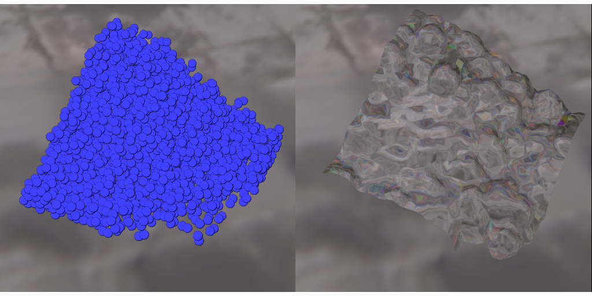

Due 2024-10-22.

 

## Problem description

The purpose of this assignment is to get a somewhat more serious
parallel programming experience using OpenMP. Your goal is to
parallelize a three dimensional [smoothed particle hydrodynamics][wiki-sph]
simulation. A reference serial implementation is documented [here][code]. The
current version uses a spatial hashing algorithm to significantly
reduce the cost of checking interactions. The assignment tasks are as
follows:

* Complete the missing calls to the spatial hashing algorithm which
  will improve the complexity by changing from the naive O(n^2)
  algorithm to an O(n) (roughly) force evaluation algorithm based on
  spatial partitioning.

* Profile the serial code and report on any bottlenecks.  Is the time
  going where you expected?  Ideally, both your serial and parallel
  performance tuning should be informed by profiling experiments.

* Parallelize your code using OpenMP, and spend some time tuning the
  parallel implementation. You will need to go beyond just adding
  pragmas before your for loops in order to get reasonable speed! As for reference, spatial hashing with some parallelization should make your code run under 50s in the default setup.

* Do a scaling study to characterize the performance of both your
  serial and parallel codes as a function of the number of particles
  in the system and the number of processors. Try to explain what you
  see. Where are the bottlenecks? What are the parallel overheads? Do
  you have good load balance? Are you making good use of the memory
  system? For several of these questions, you may find it useful to
  try timing your code with Intel VTune, gperftools, IPM, or TAU 
  (all of which are installed on the cluster).

* If you have extra time, play a little! Improve or extend the code in
  some way that appeals to you, either by doing something clever with
  the time integrator (e.g. automatic adaptation of the time step), or
  adding a feature (We deliberately left out the surface tension
  calculations), or by doing something else. If this project appeals
  to you, extensions to it could easily be the basis of a class
  project.

To visualize the output files generated by the code, use the provided
webgl viewer: [viewer.html][webglviewer]. Here is a short guide for how to use it:
- Press `z` to run or pause the animation (default to pause at the first frame of the animation)
- When the animation is paused, press `n` to show the next frame or press `p` to show the previous frame.
- To render your SPH particles with a more realistic water shader, press `t`. Pressing `t` again would switch you back to the basic particle shading. We don't recommend to use the realistic shader while playing the animation though, since it is too computationally intensive and can drop your frame rate drastically.
You can get started with the serial code by reading the annotated
source code, which I generated from the file sources using dsbweb, my
home-grown literate programming tool.

[wiki-sph]: http://en.wikipedia.org/wiki/Smoothed-particle_hydrodynamics
[webglviewer]: http://www.cs.cornell.edu/~bindel/class/cs5220-s14/html/websph/viewer.html

## Running your implementation on Perlmutter

Like what you did in HW1 & HW2, you can use `sbatch submit_sph_job.sub` to run your implementation with the output and error recorded in `sph_jobID.out` and `sph_jobID.err` respectively. Alternatively, for fast debugging, you can run your script with on an interactive shell with `salloc` and `srun`. 

## Submission

You are expected to do this assignment in groups of 2-5, though
everybody should get familiar enough with all the tasks to be able to
do them independently. One person in your group should be a non-CS
student (if possible), but otherwise you're responsible for finding a
group. You do not have to have the same groups as last time.

You will submit your code on [CMS][cms], but the main deliverable for
this project is a report. Here is a list of items you might show in
your report:

* A plot in log-log scale that shows that your serial and parallel
  codes run in O(n) time, and a description of the data structures
  that you used to achieve it.

* A recording of your simulation output running on `viewer.html`.

* Profiling data to illustrate the bottlenecks in your code.

* A description of the synchronization you used in the OpenMP code.

* A description of the design choices that you tried and how did they
  affect the performance.

* Speedup plots that show how closely your parallel codes approach the
  idealized p-times speedup and a discussion on whether it is possible
  to do better.

* Where does the time go? Consider breaking down the runtime into
  computation time, synchronization time and/or communication
  time. How do they scale with the number of processors? The number of
  particles?

## Resources

* In addition to the [code description][pdfhw], we wrote a [little
  note][pdfderivsph] on how we got from Muller's paper to the formula
  in the provided implementation.
* This assignment borrows heavily from the [F11 2D SPH
  project][sphF11]
* We have added some notes on [spatial binning and
  hashing][pdfbinhash] that you might find helpful.
* [OpenMP tutorial from LLNL][omptutorial]
* [Another OpenMP tutorial][omptutorial2]
* [OpenMP specifications][ompspec]

[code]:https://github.com/cs5220-f24/P2
[webglviewer]:http://www.cs.cornell.edu/~bindel/class/cs5220-s14/html/websph/viewer.html
[pdfhw]:http://www.cs.cornell.edu/~bindel/class/cs5220-s14/sphcode.pdf
[pdfderivsph]:http://www.cs.cornell.edu/~bindel/class/cs5220-s14/sphderivation.pdf
[pdfbinhash]:http://www.cs.cornell.edu/~bindel/class/cs5220-s14/spatial.pdf
[sphF11]:http://www.cs.cornell.edu/~bindel/class/cs5220-f11/proj2.html
[omptutorial]:https://computing.llnl.gov/tutorials/openMP/
[omptutorial2]:http://openmp.org/wp/2008/11/sc08-openmp-hands-on-tutorial-available/
[ompspec]:http://openmp.org/wp/openmp-specifications/
[cms]: http://cms.csuglab.cornell.edu/web/guest
